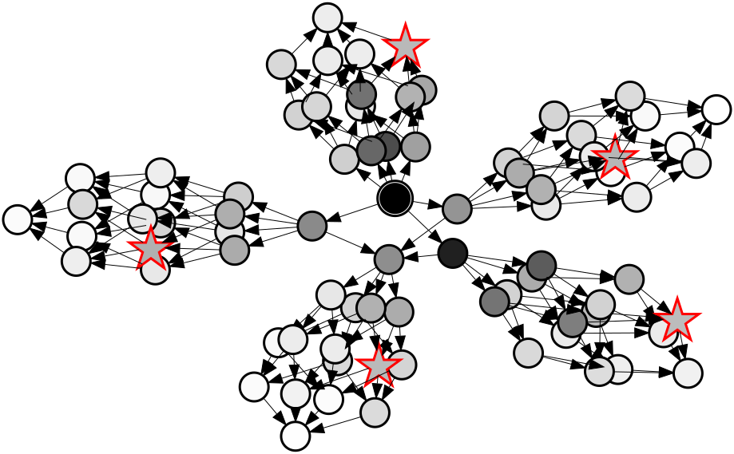

# FlexOS ASPLOS'22 Artifact Evaluation

This repository contains the artifacts, including experiments and graphs, for
the paper:

### FlexOS: Towards Flexible OS Isolation

 > **Abstract**:  At design time, modern operating systems are locked in a
> specific safety and isolation strategy that mixes one or more
> hardware/software protection mechanisms (e.g. user/kernel separation);
> revisiting these choices after deployment requires a major refactoring effort.
> This rigid approach shows its limits given the wide variety of modern
> applications' safety/performance requirements, when new hardware isolation
> mechanisms are rolled out, or when existing ones break.
> 
> We present FlexOS, a novel OS allowing users to easily specialize the
> safety and isolation strategy of an OS at compilation/deployment time
> instead of design time. This modular LibOS is composed of fine-grained
> components that can be isolated via a range of hardware protection mechanisms
> with various data sharing strategies and additional software hardening. The
> OS ships with an exploration technique helping the user navigate the vast
> safety/performance design space it unlocks. We implement a prototype of the
> system and demonstrate, for several applications (Redis/Nginx/SQLite),
> FlexOS’ vast configuration space as well as the efficiency of the
> exploration technique: we evaluate 80 FlexOS configurations for Redis and
> show how that space can be probabilistically subset to the 5 safest ones under
> a given performance budget. We also show that, under equivalent
> configurations, FlexOS performs similarly or better than several
> baselines/competitors.


If at all possible, please read through this entire document before installing
or running experiments.

## 1. Experiments

The paper comes with 11 figures and 1 tables worth of experiments (although not
all of them have experimental results, e.g.,  Figure 2 is an architecture
diagram).  Each experiment and the relevant scripts to generate the data and
subsequent plots are included in this repository.  We expect the results
generated from this artifact to match one-to-one with the results in the paper,
given that we used this artifact/scripts to actually generate all figures in the
paper.

Each figure, table and corresponding experiment are listed below:

| Figure                                                  |                                                                   | Description                                                                                                                                                                                                                                                                                                                     | Est. runtime |
| ------------------------------------------------------- | ----------------------------------------------------------------- | ------------------------------------------------------------------------------------------------------------------------------------------------------------------------------------------------------------------------------------------------------------------------------------------------------------------------------- | ------------ |
| [`fig-06`](/experiments/fig-06_nginx-redis-perm/)       |        | Redis (top) and Nginx (bottom) performance for a range of configurations. Components are on the left. Software hardening can be enabled [●] or disabled [○] for each component. The white/blue/red color indicates the compartment the component is placed into. Isolation is achieved with MPK and DSS.                        | 0h 0m        |
| [`fig-07`](/experiments/fig-07_nginx-redis-normalized/) |  | Nginx versus Redis normalized performance.                                                                                                                                                                                                                                                                                      | 0h 0m        |
| [`fig-08`](/experiments/fig-08_config-poset/)           |            | Configurations poset for the Redis numbers (Figure 6).  Stars are the most secure configs. with perf. >= 500k req/s.                                                                                                                                                                                                            | N/A        |
| [`fig-09`](/experiments/fig-09_iperf-throughput/)       |        | NW throughput (iPerf) with Unikraft (baseline), FlexOS w/o isolation, with 2 compartments backed by MPK (-_light_ = shared call stacks, -_dss_ = protected and DSS) and EPT.                                                                                                                                                    | 0h 0m        |
| [`fig-10`](/experiments/fig-10_sqlite-exec-time/)       |        | Time to perform 5000 INSERT queries with SQLite on Unikraft, FlexOS, Linux, SeL4 (with the Genode system), and CubicleOS. The isolation profile is shown on the x axis (NONE: no isolation, MPK3: MPK with three compartments, EPT2: two compartments with EPT, PT2/3: two/three compartments with page-table-based isolation). | 0h 0m        |
| [`fig-11`](/experiments/fig-11_flexos-alloc-latency/)   |    | FlexOS latency microbenchmarks.                                                                                                                                                                                                                                                                                                 | 0h 0m        |

| Table                                           |                                                           | Description                                                                                            | Est. runtime |
| ----------------------------------------------- | --------------------------------------------------------- | ------------------------------------------------------------------------------------------------------ | ------------ |
| [`tab-01`](/experiments/fig-01_porting-effort/) |  | Porting effort: size of the patch (including automatic gate replacements), number of shared variables. | 0h 0m        |

## 2. Repository structure

We have organised this repository as follows:

 * `experiments/` - All experiments are listed in this directory.  Each
   sub-directory is named with the figure number along with a short description
   of the experiment (e.g., `fig-06_nginx-redis-perm`).  In addition, each
   experiment sub-directory has a corresponding `README.md` which explains in
   more detail how the experiment works and how to run it.  Along with this,
   each sub-directory also comes with a `Makefile` with the following targets:
    - `prepare`: prepares the experiment, by usually downloading and building
      relevant images, tools, and auxiliary services necessary for running the
      experiment.
    - `run`: runs the experiment.
    - `plot`: produces the figure or table.  All plots are automatically saved
      into the [`plots/`](/plots) directory.
    - `clean`: removes intermediate build files.
 * `plots/` - Contains all resulting figures seen in the paper.

## 3. Prerequisites

Before you can run these experiments, you will need to prepare a physical host
environment.  Access to the physical host environment is important as it is
required to run Virtual Machine (VM) images.

All benchmarks are performance and latency sensitive, as such it is critical to
avoid any source of noise on the machine, such as concurrently running
processes, other users, etc. If the machine is shared (as is the case for the
ASPLOS'22 AE setup), it is critical that the different users coordinate on the
use of the physical machine.

All our results were run on an Intel® Xeon® Silver 4114 with 128.0 GB RAM,
Debian 11.1, and Linux version `5.10.70-1`. This artifact may be run with
any processor that supports Intel MPK, typically any Intel® Xeon® Scalable
Processor starting with the Skylake generation (but the results might differ
from the paper). This artifact was only tested on Debian 11.1, but any
Debian-based distribution with similar package versions should be suitable.


## 4. Getting started

1. Before running any of these experiments, prepare your host with the
   recommendations detailed above in [prerequisites](#3-prerequisites);

2. Many of the experiments use Docker as an intermediate tool for creating build
   and test environments (along with testing Docker itself).  Please
   [install Docker](https://docs.docker.com/get-docker/) on your system to
   continue. This artifact makes heavy use of Docker containers, and so we
   recommend you to use a recent version of Docker to avoid storage pool issues.
   See [troubleshooting](#5-troubleshooting).

3. Once Docker is installed, clone this repository
   ```bash
   git clone https://github.com/project-flexos/asplos22-ae.git
   ```

4. All experiments should be `prepare`d first, which installs necessary tools
   and downloads additional resources, before they can run.  This can be done
   for a single experiment, for example:
   ```bash
   make prepare-fig-07
   ```
   or for all experiments via:
   ```
   make prepare
   ```
5. Once one or many experiments have been prepared, they can be run, again using
   a similar syntax as above:
   ```bash
   make run-fig-07
   ```
   or for all experiments via:
   ```
   make run
   ```
   This will generate the relevant experimental results within the experimental
   folder of the specific experiment.
6. To plot one or many experiment's figures, use, for example:
   ```bash
   make plot-fig-07
   ```
   or for all experiments via:
   ```
   make plot
   ```
7. You can clean, or "properclean" to completely reset any preparation, with
   `make clean` or `make properclean` and for individual experiments, for
   example: 
   ```bash
   make clean-fig-07
   make properclean-fig-07
   ```
   or for all experiments via:
   ```
   make clean
   make properclean
   ```

**Note**: some experiments have a slightly different workflow. Figure 8
is only a plot and requires some manual steps. Figure 11 requires a reboot
of the machine with different kernel parameters. In all of these cases, the
local `README.md` provides appropriate explanations.

## 5. Troubleshooting

Note that each experiment folder (e.g., `experiments/fig-10_sqlite-exec-time/`)
has its own `README.md` and corresponding troubleshooting section. If you are
searching information regarding a particular experiment, take a look there as
well!

- **Problem**: Docker containers fail to build with errors indicating
  insufficient memory available.

  **Solution**: This artifact makes heavy use of Docker containers. Older
  versions of Docker are known to have issues with the maximum size of Docker
  containers or of the storage pool. Check the output of `docker info`. It should
  show `overlay2`. If it indicates `devicemapper`, your installation
  might be old or using the Debian/Ubuntu repositories. In this case, we recommend
  a fresh reinstall of Docker.

## 6. Beyond the Paper

This repository contains all scripts necessary to reproduce the experiments of
our ASPLOS'22 paper. It does not contain the FlexOS kernel, libraries, and
applications themselves. You can find all other repositories hosted under the
[same GitHub organization](https://github.com/unikraft/eurosys21-artifacts).
The FlexOS core kernel repository, in particular, lives in [this
repository](https://github.com/project-flexos/unikraft).  You can find
instructions on porting applications and building your own FlexOS images in the
core kernel repository's
[`README.md`](https://github.com/project-flexos/unikraft/blob/staging/README.md).

## 7. Disclaimer

This artifact is the first release of a research proof-of-concept for flexible
OS isolation. Like any research prototype, it contains hacks, bugs, and TODOs. We
do not recommend using it in production, but whish that it will foster further
research!

## 8. Acknowledgements

This artifact would not exist without the hard work of the Unikraft community.
We encourage interested researchers to visit the project's [web
page](https://unikraft.org/) and [GitHub](https://github.com/unikraft/).
