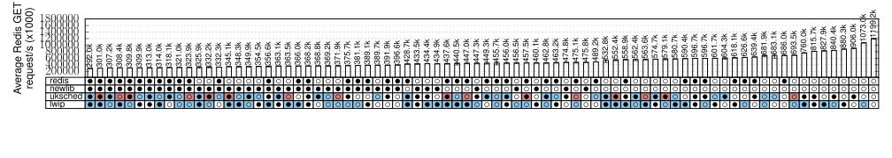
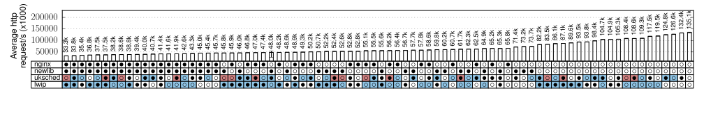

# NGINX and Redis Performance Across Varying Compartmentalisation Permutations




| Estimated Prepare Time | Estimated Runtime |
| ---------------------- | ----------------- |
| 4-10 hours             | 2-3 hours         |

## Overview

Redis (top) and Nginx (bottom) performance for a range of configurations.
Components are on the left. Software hardening can be enabled [●] or disabled
[○] for each component. The white/blue/red color indicates the compartment the
component is placed into. Isolation is achieved with MPK and DSS.

This experiment utilises the generic OS performance evaluation platform
[Wayfinder](https://github.com/lancs-net/wayfinder).  Wayfinder is fully
automated and ensures both the accuracy and reproducibility of results.  It is
used to generate all the permutations of library compartmentalizations seen in
figure 6 of the paper.

## Makefile command summary

| Target                                 | Description                                                                                                                              |
| -------------------------------------- | ---------------------------------------------------------------------------------------------------------------------------------------- |
| `make prepare-wayfinder-app-nginx`     | Generates a job file for Wayfinder for NGINX.                                                                                            |
| `make prepare-wayfinder-app-redis`     | Generates a job file for Wayfinder for Redis.                                                                                            |
| `make prepare-templates`               | Creates all job files for Wayfinder for NGINX and Redis.                                                                                 |
| `make prepare`                         | Runs all preparation steps, including generating job files for Wayfinder and installing additional necessary tooling for the experiment. |
| `make run-wayfinder-app-nginx`         | Generates all permutations for NGINX.                                                                                                    |
| `make run-wayfinder-app-redis`         | Generates all permutations for Redis.                                                                                                    |
| `make run-wayfinder`                   | Runs both NGINX and Redis wayfinder permutation builds.                                                                                  |
| `make test-app-nginx`                  | Runs the [test script](./apps/nginx/test.sh) against all NGINX permutations.                                                             |
| `make test-app-redis`                  | Runs the [test script](./apps/redis/test.sh) against all Redis permutations.                                                             |
| `make run`                             | Runs both tests, for NGINX and for Redis.                                                                                                |
| `make plot-app-nginx`                  | Just plot the NGINX figure.                                                                                                                                         |
| `make plot-app-redis`                  | Just plot the Redis figure.                                                                                                                                         |
| `make plot`                            | Plot both figures.                                                                                                                                         |

## Running & customisation

This figure has its targets mapped as part of the global `Makefile` system of
the FlexOS Project Artifact Evaluation (AE) repository for ASPLOS'22.  At a
high-level, you can run:

```bash
make prepare-fig-06
make run-fig-06
make plot-fig-06
```

...And the experiment will run.  However, more likely you wish to tune the
experiment to your needs.  There are a number of internal targets which can run
independently of the high-level `Makefile` ASPLOS'22 AE repo.  To get started,
clone this repository and `cd` into this directory:

```bash
git clone https://github.com/project-flexos/asplos-ae.git
cd asplos-ae/experiments/fig-06_nginx-redis-perm
```

The applications to be constructed are "variable" (note that adding new apps
requires creating a build environment for them.  See the repository's `support/`
folder for examples).  This means we can target them individually.  To run the
permutations for NGINX, for example, you can run:

```
make prepare-wayfinder-app-nginx
make run-wayfinder-app-nginx
```

The same applies for Redis:

```
make prepare-wayfinder-app-redis
make run-wayfinder-app-redis
```

The number of compartments is a global variable which can be via the variable
`NUM_COMPARTMENTS=n`.  By default and for the paper, this was set to `3` to
demonstrate a good range of permutations and variety whilst still being
comprehendable.  For example, if you wish to build only 2 compartments, try
as follows:

```
NUM_COMPARTMENTS=2 make prepare-wayfinder-app-nginx
```

This step is used to generate a job file for
[Wayfinder](https://github.com/lancs-net/wayfinder).  Once this job file has
been created, it can be passed to wayfinder to take over and run the
construction of 96 unique images for both NGINX and Redis.

 > **Note!** Wayfinder will report 144 permutations.  The difference (48 images)
 > is expected as these are invalid permutations.

To start wayfinder for the application, run, for example:

```
NUM_COMPARTMENTS=2 make run-wayfinder-app-nginx
```

After the build, it is time to test each image.  You can do so for the specific
application via:

```
NUM_COMPARTMENTS=2 make test-app-nginx
```

Finally, plot the specific application via:

```
NUM_COMPARTMENTS=2 make plot-app-nginx
```