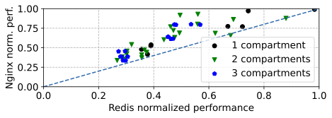

# NGINX versus Redis normalized performance

| Estimated prep. time | Estimated runtime |
| -------------------- | ----------------- |
| N/A                  | 0h 01m            |

## Overview

Nginx versus Redis normalized performance. This plot plots the data set
generated by [Figure
6](https://github.com/project-flexos/asplos22-ae/tree/main/experiments/fig-06_nginx-redis-perm)
in a scatter form.

There is no `make prepare` or `make run` step, only `make plot`. Note that this
figure must be run after Figure 6.
