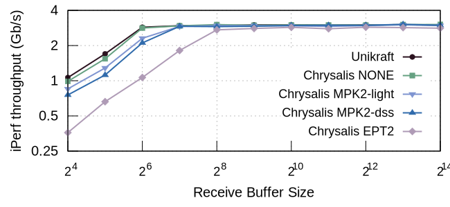

# iPerf throughput

| Estimated prep. time | Estimated runtime |
| -------------------- | ----------------- |
| 0h 0m                | 0h 00m            |

## Overview

Network throughput (iPerf) with Unikraft (baseline), FlexOS w/o isolation, with
2 compartments backed by MPK (-_light_ = shared call stacks, -_dss_ = protected
and DSS) and EPT.

## Troubleshooting

- **Problem**: EPT measurements show very low performance, not achieving more
  than a few 100Mb/s.

  **Solution**: This is typically due to pinning issues. EPT measurements are not
  all pinned like MPK measurements for technical reasons, and they use 4
  non-isolated cores. If these cores are improperly set (different NUMA node
  than isolated ones, noise on them), this might result in drastic loss of
  performance.

- **Problem**: All measurements are blocked at 1.9-2.0Gb/s (while they should
  achieve around 3Gb/s).

  **Solution**: This issue seems to happen from time to time even in correct
  setups, and we do not have a good explanation for it. iPerf is an extremely
  sensitive benchmark that involves not only two different TCP stacks (guest
  plus the host) but also very complex TCP behaviors. In this case
  the solution was generally to restart the machine with `reboot`.
