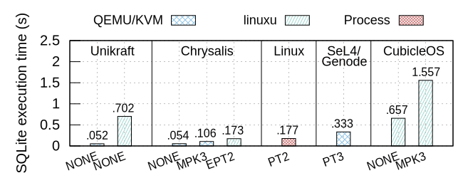

# SQLite Performance Comparison



| Estimated prep. time | Estimated runtime |
| -------------------- | ----------------- |
| 0h 0m                | 0h 00m            |

## Overview

Time to perform 5000 INSERT queries with SQLite on Unikraft, FlexOS, Linux, SeL4
(with the Genode system), and CubicleOS. The isolation profile is shown on the x
axis (NONE: no isolation, MPK3: MPK with three compartments, EPT2: two
compartments with EPT, PT2/3: two/three compartments with page-table-based
isolation).

### Plot

The plot contains some hardcoded data. If you want to generate a plot
for your new run, you will need to edit the plot script. The values that you
will want to adapt are the labels in the latency plot (and potentially their
position).

## Troubleshooting

- **Problem**: The run script hangs while benchmarking CubicleOS, with messages
  such as
   ```
   cannot allocate memory for SQLITE
   ```

  **Solution**: This is a known CubicleOS bug. In this case, simply terminate the
  current run with `CTRL-C`; the results for this run will not be considered in the
  final average.
