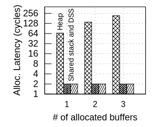

# FlexOS Latency Microbenchmarks

 

| Estimated prep. time | Estimated runtime |
| -------------------- | ----------------- |
| 0h 0m                | 0h 00m            |

## Overview

Gate and allocation latency microbenchmarks. FlexOS is compared with Linux
(with and without KPTI).

### Measurement workflow

This experiment is somewhat special, as it requires one measurement with KPTI
disabled on the host system. This requires changes to the kernel command line
and a reboot. The workflow is therefore slightly different, but we tried to
make it as streamlined as possible:

1. Prepare the experiment as usual with `make prepare`
2. Run the first numbers as usual with `make run`
3. Disable KPTI using `./toggle-kpti.sh off`
4. After the reboot, run `make run` again
5. Re-enable KPTI with `./toggle-kpti.sh on`

As soon as you are done with step (4), we recommend that you immediately proceed to
step 5 to reset the machine to its initial state.

Note (especially to ASPLOS'22 AE reviewers): disabling KPTI will affect all
other measurements, not only Linux for this figure. Make sure to re-enable KPTI
as soon as you are done with this measurement. Cooperation among reviewers for
this benchmark is recommended.

### Plot

The latency plot contains some hardcoded data. If you want to generate a plot
for your new run, you will need to edit the plot script. The values that you
will want to adapt are the labels (and potentially their position).

## Troubleshooting

- **Problem**: Every once in a while, EPT results increase to ~700 cycles
  (instead of ~500 expected).

  **Solution**: It is not entirely clear why this happens. We suspect a
  combination of unlucky scheduling of vCPU threads (not pinned
  in this specific case due to a missing implementation in `qemu-guest`), and
  cache effects. In our measurements this was a rather rare symptom and
  we therefore considered it as minor. We recommend to simply restart the benchmark
  in this case.
